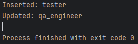
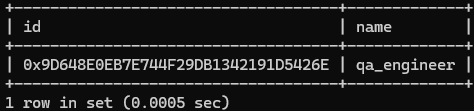

## Тема
**Система управління учбовими процесами** — реалізація роботи з таблицею `Role` у базі даних за допомогою патерну DAO (Data Access Object) на мові Java, використовуючи СУБД MySQL.

---

## Структура проєкту

```
src/
├── com.example.dao/
│   ├── RoleDAO.java
│   ├── RoleDAOImpl.java
│   └── TestRoleDAO.java
├── com.example.model/
│   └── Role.java
└── com.example.util/
    └── DatabaseConnection.java
```

---

## Опис файлів та реалізацій

### 1. `Role.java` (пакет `model`)

```java
package com.example.model;
import java.util.UUID;

public class Role {
    private UUID id;
    private String name;

    public Role(UUID id, String name) {
        this.id = id;
        this.name = name;
    }

    public UUID getId() { return id; }
    public String getName() { return name; }

    public void setId(UUID id) { this.id = id; }
    public void setName(String name) { this.name = name; }
}
```

---

### 2. `RoleDAO.java` (інтерфейс DAO)

```java
package com.example.dao;

import com.example.model.Role;
import java.util.List;
import java.util.UUID;

public interface RoleDAO {
    void addRole(Role role);
    Role getRoleById(UUID id);
    List<Role> getAllRoles();
    void updateRole(Role role);
    void deleteRole(UUID id);
}
```

---

### 3. `RoleDAOImpl.java` (реалізація DAO)

```java
package com.example.dao;

import com.example.dao.RoleDAO;
import com.example.model.Role;
import com.example.util.DatabaseConnection;
import java.nio.ByteBuffer;
import java.sql.*;
import java.util.*;

public class RoleDAOImpl implements RoleDAO {
    private final Connection conn = DatabaseConnection.getConnection();

    public void addRole(Role role) {
        String sql = "INSERT INTO role (id, name) VALUES (?, ?)";
        try (PreparedStatement stmt = conn.prepareStatement(sql)) {
            stmt.setBytes(1, toBytes(role.getId()));
            stmt.setString(2, role.getName());
            stmt.executeUpdate();
        } catch (SQLException e) { e.printStackTrace(); }
    }

    public Role getRoleById(UUID id) {
        String sql = "SELECT * FROM role WHERE id = ?";
        try (PreparedStatement stmt = conn.prepareStatement(sql)) {
            stmt.setBytes(1, toBytes(id));
            ResultSet rs = stmt.executeQuery();
            if (rs.next()) {
                return new Role(fromBytes(rs.getBytes("id")), rs.getString("name"));
            }
        } catch (SQLException e) { e.printStackTrace(); }
        return null;
    }

    public List<Role> getAllRoles() {
        List<Role> roles = new ArrayList<>();
        try (Statement stmt = conn.createStatement()) {
            ResultSet rs = stmt.executeQuery("SELECT * FROM role");
            while (rs.next()) {
                roles.add(new Role(fromBytes(rs.getBytes("id")), rs.getString("name")));
            }
        } catch (SQLException e) { e.printStackTrace(); }
        return roles;
    }

    public void updateRole(Role role) {
        String sql = "UPDATE role SET name=? WHERE id=?";
        try (PreparedStatement stmt = conn.prepareStatement(sql)) {
            stmt.setString(1, role.getName());
            stmt.setBytes(2, toBytes(role.getId()));
            stmt.executeUpdate();
        } catch (SQLException e) { e.printStackTrace(); }
    }

    public void deleteRole(UUID id) {
        String sql = "DELETE FROM role WHERE id=?";
        try (PreparedStatement stmt = conn.prepareStatement(sql)) {
            stmt.setBytes(1, toBytes(id));
            stmt.executeUpdate();
        } catch (SQLException e) { e.printStackTrace(); }
    }

    private byte[] toBytes(UUID uuid) {
        ByteBuffer bb = ByteBuffer.wrap(new byte[16]);
        bb.putLong(uuid.getMostSignificantBits());
        bb.putLong(uuid.getLeastSignificantBits());
        return bb.array();
    }

    private UUID fromBytes(byte[] bytes) {
        ByteBuffer bb = ByteBuffer.wrap(bytes);
        return new UUID(bb.getLong(), bb.getLong());
    }
}
```

---

### 4. `DatabaseConnection.java`

```java
package com.example.util;

import java.sql.Connection;
import java.sql.DriverManager;
import java.sql.SQLException;

public class DatabaseConnection {
    private static final String URL = "jdbc:mysql://localhost:3306/studyrole";
    private static final String USER = "root";
    private static final String PASSWORD = "password";

    private static Connection connection;

    public static Connection getConnection() {
        if (connection == null) {
            try {
                connection = DriverManager.getConnection(URL, USER, PASSWORD);
            } catch (SQLException e) {
                System.err.println("Помилка при з’єднанні з БД:");
                e.printStackTrace();
            }
        }
        return connection;
    }
}
```

---

### 5. `TestRoleDAO.java`

```java
package com.example.dao;

import com.example.dao.RoleDAOImpl;
import com.example.model.Role;

import java.util.UUID;

public class TestRoleDAO {
    public static void main(String[] args) {
        RoleDAOImpl dao = new RoleDAOImpl();

        UUID id = UUID.randomUUID();
        Role r = new Role(id, "tester");

        dao.addRole(r);
        System.out.println("Inserted: " + dao.getRoleById(id).getName());

        r.setName("qa_engineer");
        dao.updateRole(r);
        System.out.println("Updated: " + dao.getRoleById(id).getName());

        //dao.deleteRole(id);
        //System.out.println("Deleted: " + (dao.getRoleById(id) == null));
    }
}
```

---

## SQL для створення таблиці `role`

```sql
CREATE DATABASE IF NOT EXISTS studyrole;
USE studyrole;

CREATE TABLE IF NOT EXISTS role (
    id BINARY(16) PRIMARY KEY,
    name VARCHAR(100) NOT NULL
);
```

---

## Скріншоти

Створення Ролі

Результат створення


---

## Висновок

Було реалізовано повну структуру DAO для роботи з таблицею `role`. DAO надає інтерфейс для роботи з даними та дозволяє зручно масштабувати систему в рамках проєкту з управління учбовими процесами.
